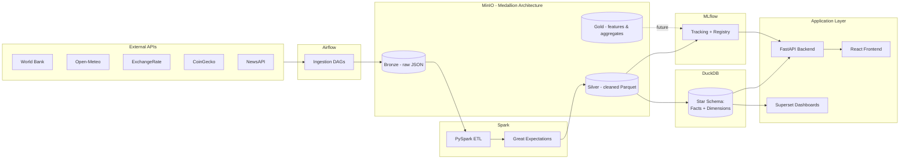
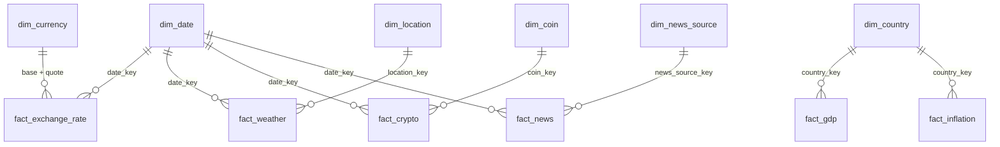

# Architecture

## System diagram

## Why this shape

- **Medallion storage (Bronze/Silver/Gold in MinIO)** keeps raw data
  immutable and separates "what we received" from "what we trust."
- **DuckDB as the warehouse** avoids standing up a full Postgres/Snowflake
  analytics stack for what is, at this stage, a single-node analytical
  workload — it reads Parquet directly out of MinIO.
- **Airflow orchestrates, Spark transforms** — DAGs stay thin (trigger +
  monitor), heavy lifting lives in versioned PySpark jobs that can be
  tested independently of the scheduler.
- **MLflow sits beside, not inside, the API** — models are trained and
  registered out-of-band; the API only ever loads a registered model
  version, it never trains one.

## Warehouse star schema (Day 1, Step 10)

The validated Silver layer is loaded into a DuckDB star schema. The DDL is in
[`warehouse/schema/star_schema.sql`](../warehouse/schema/star_schema.sql); the
loader is [`pipelines/warehouse/`](../pipelines/warehouse/).

- **`dim_date` is conformed** — every daily-grain fact shares it. `fact_gdp` is
  the exception: GDP is annual, so it carries `year` directly rather than
  joining a daily date dimension.
- **`dim_currency` is conformed across both sides of a pair** —
  `fact_exchange_rate` has two FKs (`base_currency_key`, `quote_currency_key`)
  into the one currency dimension.
- **Loads are idempotent** — dimensions upsert on their natural key onto a
  stable surrogate key; facts upsert on their grain. Re-loading the same Silver
  dataset (a DAG retry, a rolling-window re-pull) leaves the warehouse
  identical, extending the same guarantee Bronze and the Spark merge step
  already provide.
- **`fact_inflation` (Day 2) is a sibling of `fact_gdp`, not a reuse of it** —
  both come from the World Bank connector (different indicator codes) and
  share `dim_country`, but a column literally called `gdp_usd` would be a
  misnomer for an inflation percentage, so inflation gets its own table at
  the same (country, indicator, year) grain.

## Warehouse repository layer: views, aggregations, ML features (Day 2, Step 1/2)

[`warehouse/schema/views.sql`](../warehouse/schema/views.sql) sits on top of
the star schema, applied right after it (see `pipelines/warehouse/schema.py`).
Two kinds of view:

- **`view_*`** (one per fact) - denormalizes surrogate keys to human-readable
  names and adds exactly one lag column and one rolling-average column via a
  window function (e.g. `view_gdp` adds `lag1_gdp_usd` and `gdp_3yr_avg_usd`).
  This *is* Day 2's feature engineering layer - rather than reopening the
  Day 1 Spark transforms to add ML features, they're computed straight from
  the warehouse. The backend's read endpoints and the ML trainers query these
  same views, so both sides see identical numbers for identical rows without
  sharing any Python code.
- **`agg_*`** (5 rollups) - genuine `GROUP BY` aggregates a per-row view can't
  answer: `agg_gdp_by_country` computes CAGR from each country's first and
  latest reported year (via `ARG_MIN`/`ARG_MAX`); the rest are monthly
  averages (exchange rate, crypto, weather) or a latest/average summary
  (inflation).

Two thin "stored query" wrappers read these views - `pipelines/warehouse/repository.py`
(returns whole pandas DataFrames, for training) and `backend/app/repository.py`
(returns filtered/paginated dict pages, for the API). Neither imports the
other; the shared truth both agree on is the view itself, not shared Python -
the same reason the backend has no dependency on `pipelines/` at runtime.

## MLflow tracking, registry, and the four forecast models (Day 2, Step 3/4/5)

`pipelines/ml/mlflow_utils.py` wraps the MLflow SDK the same way `BronzeWriter`
wraps boto3 - `log_run` persists params/metrics/model artifact, `register_model`
registers a version from an already-logged run, and deployment uses the modern
**alias** API (a `champion` alias) rather than the deprecated stage API
(Staging/Production). `should_promote` is the champion/challenger gate: a
new version only takes over `champion` if its MAE beats whichever version
currently holds that alias.

`pipelines/ml/train.py` is one generic pooled-regression trainer (predict the
next value from `[lag1, rolling_avg]`) shared by all four domains via a
`ForecastSpec` registry in `pipelines/ml/models.py` - GDP, inflation, exchange
rate, and crypto are structurally identical once their view is a DataFrame, so
this is one trainer with four specs, not four near-duplicate scripts. Holdout
is the *last* chronological row per entity (country / currency pair / coin);
this needs no fallback split, because every row reaching the split already has
a non-null lag feature (dropped otherwise), so a per-entity holdout can never
leak an entity's first-ever observation into the test set.

`airflow/dags/_training_dag_factory.py` builds the four nightly DAGs
(`train_{gdp,inflation,exchange_rate,crypto}_forecast`) around three tasks:
`extract_train_evaluate` (fit + evaluate share in-memory objects, so they're
one task), `register`, `deploy`. Only small metadata (a model URI, a version
string, an MAE) crosses Airflow's XCom between tasks - never the model object,
which isn't XCom-safe and doesn't need to be: MLflow's own tracking store is
where the artifact actually lives once the first task logs it.

Both the Model Registry's real deployment (Postgres-backed) and its test
double (a local sqlite file) are database-backed stores - a plain local
*file* store does not support the Model Registry at all, which is why tests
use `sqlite:///` rather than a bare local path.

## FastAPI domain and ML endpoints (Day 2, Step 6)

`backend/app/routers/` has one read-only router per warehouse fact -
`/countries` + `/gdp` + `/inflation`, `/exchange`, `/weather`, `/crypto`,
`/news` - each supporting simple filters and a shared pagination envelope
(`items`, `total`, `limit`, `offset`). Three more routers are ML-backed:
`/predictions` loads the champion model for a domain (via
`app/mlflow_client.py`) and applies it to an entity's latest feature row;
`/models` lists every registered model with its champion version and metrics;
`/pipeline-status` reports the latest run state per training DAG by calling
Airflow's own REST API (`app/airflow_client.py`) rather than reaching into
Airflow's metadata database directly.

- **The backend only reads** — `app/db.py` opens a fresh `read_only=True`
  DuckDB connection per request rather than a pooled read/write one, so the
  API never contends for the file lock a concurrent warehouse load might be
  holding, and can never itself corrupt the warehouse.
- **The backend has no dependency on `pipelines/`** — its Dockerfile copies
  only `app/`, so `app/db.py`, `app/repository.py`, and `app/mlflow_client.py`
  talk to the warehouse and MLflow purely at the protocol/SQL level, with no
  Python-level coupling to `pipelines/warehouse/` or `pipelines/ml/`.
- **A missing/unloaded warehouse file returns `503`**, not `500` — the
  warehouse not existing yet is an expected state during first-time setup, not
  a bug. A domain with no champion model yet, or an entity absent from the
  warehouse, returns `404` for the same reason.

## Simple JWT auth (Day 2, Step 7)

`backend/app/auth.py` — one admin credential from environment variables
(`AUTH_ADMIN_USERNAME` / `AUTH_ADMIN_PASSWORD`), compared with
`secrets.compare_digest` rather than `==` to avoid a timing side-channel.
`POST /auth/login` issues an HS256 JWT; `app/main.py` attaches
`Depends(get_current_user)` to every router except the auth router itself and
`/health`, which stay open so login and container healthchecks don't need a
token already in hand.

## Explicit non-goals for Day 1, Step 1

- No connector logic (Day 1, Step 4)
- No DAG business logic beyond a proven "hello world" trigger (Day 1, Step 5)
- No Spark transformation logic (Day 1, Step 8)
- No warehouse repository layer, ML pipelines, or FastAPI/auth beyond a
  health check (Day 2)
- No React UI or Superset dashboards (Day 3)

This document will be updated as each milestone lands.
