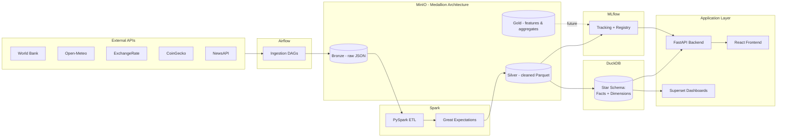
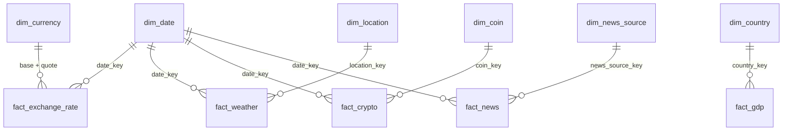

# Architecture

## System diagram

## Why this shape

- **Medallion storage (Bronze/Silver/Gold in MinIO)** keeps raw data
  immutable and separates "what we received" from "what we trust."
- **DuckDB as the warehouse** avoids standing up a full Postgres/Snowflake
  analytics stack for what is, at this stage, a single-node analytical
  workload — it reads Parquet directly out of MinIO.
- **Airflow orchestrates, Spark transforms** — DAGs stay thin (trigger +
  monitor), heavy lifting lives in versioned PySpark jobs that can be
  tested independently of the scheduler.
- **MLflow sits beside, not inside, the API** — models are trained and
  registered out-of-band; the API only ever loads a registered model
  version, it never trains one.

## Warehouse star schema (Day 1, Step 10)

The validated Silver layer is loaded into a DuckDB star schema. The DDL is in
[`warehouse/schema/star_schema.sql`](../warehouse/schema/star_schema.sql); the
loader is [`pipelines/warehouse/`](../pipelines/warehouse/).

- **`dim_date` is conformed** — every daily-grain fact shares it. `fact_gdp` is
  the exception: GDP is annual, so it carries `year` directly rather than
  joining a daily date dimension.
- **`dim_currency` is conformed across both sides of a pair** —
  `fact_exchange_rate` has two FKs (`base_currency_key`, `quote_currency_key`)
  into the one currency dimension.
- **Loads are idempotent** — dimensions upsert on their natural key onto a
  stable surrogate key; facts upsert on their grain. Re-loading the same Silver
  dataset (a DAG retry, a rolling-window re-pull) leaves the warehouse
  identical, extending the same guarantee Bronze and the Spark merge step
  already provide.

## FastAPI domain endpoints (Day 2, Step 6)

`backend/app/routers/` adds one read-only router per warehouse fact —
`/countries` + `/gdp`, `/exchange-rates`, `/weather`, `/crypto`, `/news` — each
supporting simple filters and a shared pagination envelope (`items`, `total`,
`limit`, `offset`).

- **The backend only reads** — `app/db.py` opens a fresh `read_only=True`
  DuckDB connection per request rather than a pooled read/write one, so the
  API never contends for the file lock a concurrent warehouse load might be
  holding, and can never itself corrupt the warehouse.
- **The backend has no dependency on `pipelines/`** — its Dockerfile copies
  only `app/`, so `app/db.py` and the routers talk to the warehouse purely in
  SQL against the schema `warehouse/schema/star_schema.sql` defines, with no
  Python-level coupling to the loader that populated it.
- **A missing/unloaded warehouse file returns `503`**, not `500` — the
  warehouse not existing yet is an expected state during first-time setup
  (before any Step 10 load has run), not a bug.

## Explicit non-goals for Day 1, Step 1

- No connector logic (Day 1, Step 4)
- No DAG business logic beyond a proven "hello world" trigger (Day 1, Step 5)
- No Spark transformation logic (Day 1, Step 8)
- No ML pipelines / MLflow-registered model / `/predictions` endpoint
  (Day 2, Step 7)
- No React UI (Day 3, Step 1)

This document will be updated as each milestone lands.
