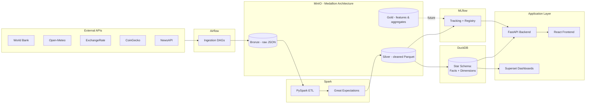

# Architecture

## System diagram

## Why this shape

- **Medallion storage (Bronze/Silver/Gold in MinIO)** keeps raw data
  immutable and separates "what we received" from "what we trust."
- **DuckDB as the warehouse** avoids standing up a full Postgres/Snowflake
  analytics stack for what is, at this stage, a single-node analytical
  workload — it reads Parquet directly out of MinIO.
- **Airflow orchestrates, Spark transforms** — DAGs stay thin (trigger +
  monitor), heavy lifting lives in versioned PySpark jobs that can be
  tested independently of the scheduler.
- **MLflow sits beside, not inside, the API** — models are trained and
  registered out-of-band; the API only ever loads a registered model
  version, it never trains one.

## Explicit non-goals for Day 1, Step 1

- No connector logic (Day 1, Step 4)
- No DAG business logic beyond a proven "hello world" trigger (Day 1, Step 5)
- No Spark transformation logic (Day 1, Step 8)
- No star schema DDL (Day 1, Step 10)
- No FastAPI domain routes (Day 2, Step 6)
- No React UI (Day 3, Step 1)

This document will be updated as each milestone lands.
